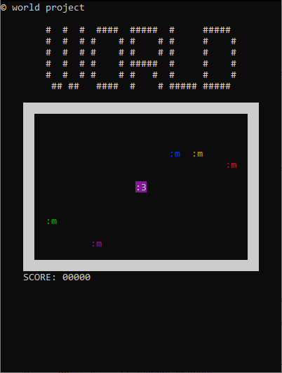

# World Game Library V2

Learn asynchronous C programming by a game.

The library implements a game loop for a character-based ncurses game;

The library finds out the event types:

- start and end
- mouse events
- keyboard events
- screen resize events

It can print colors and arbitrary characters on the screen. 
Running is interrupted when character is drawn out of the screen.

## Preview



## Changes in V2

- changed the names of variables for better clarity
- visual changes
- added array for game map
- added constants for game offsets and map dimensions
- added functions to print various game elements
- added function to clear only the active game area

## Installation and Running

Make sure, that `ncurses` is installed.

Clone this repository.

Compile:

```c
make
```
	
Run:

```c
./game
```

## Make your own game

The game happens in a rectangular world of colorful characters. 
Your goal as a programmer is to modify the world according to the pressed keys and the internal game state.
The library implements the game loop and draws the world to screen.

Your game in file `game.c` consists of two functions:

- `void* init_game()` is called in the beginning. Here you can initialize the internal state of the game.
The function should return  a pointer to an instance of the initial game state `game`.
- `int game_event(struct event* event,void* game)`
is called by the game loop in periodic interval or when a key was pressed. Non-zero return value or `Ctrl+C` key interrupts the game loop.

The world variable represents state of two-dimensional grid of characters on the screen. The screen matrix looks like this:

```
   origin
   [0,0]     width
  +--------------------+
h |                    |
e |                    |
i |                    |
g |                    |
h |                    |
t |                    |
  +--------------------+
```

The world  has the following parameters:

- `int height`: y-dimension of the grid.
- `int width`: x-dimension of the grid.
- `int interval`: maximum time between steps in milliseconds.

### The Event Function

The `int game_event(struct event* event,void* game)`
 function should:

1. Read the game state (from the `void* game`) pointer.
1. Examine the pressed key from event pointer. If the `key` variable is non-zero, a key was pressed. According to the pressed key, modify the game state `game`.
1. Draw the game state. In the beginning of the step function the screen is empty.
1. Returning non-zero value ends the game loop. 


